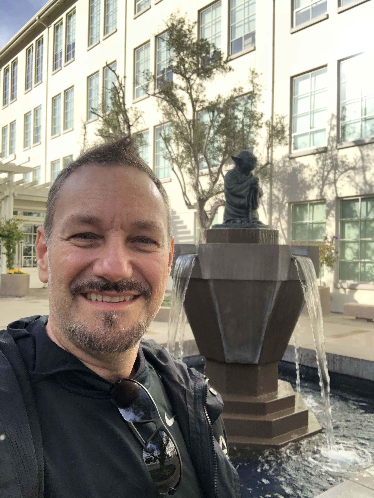

# Aside

{width="%"}

## Contact Info {#contact}

-   <i class="fa fa-envelope"></i> [rprimi\@mac.com](mailto:rprimi@mac.com){.email}
-   <i class="fa fa-github"></i> [github.com/rprimi](https://github.com/rprimi)
-   <i class="fa fa-phone"></i> +55 19 981492244
-   For more information, please contact me via email.
-   For full cv see: [github.com/rprimi/cv_primi](https://github.com/rprimi/cv_primi)
-   Last updated on `r Sys.Date()`.

## Skills {#skills}

-  Strong expertise in quantitative methods, psychometrics, and artificial intelligence  

- Design, conduct, and publish scientific research in the area of intelligence assessment and social and emotional skills 

- Wide experience in leading research projects, mentoring students, and teaching quantitative methods. 

- Strong skills in R and Python  

## Disclaimer {#disclaimer}

# Main

## Ricardo Primi {#title}

### Profile

Psychologist, Associate Professor at Universidade São Francisco (USF), Brazil. Lead scientist of EduLab21 at the Ayrton Senna Institute (IAS)

## Education {data-icon="graduation-cap" data-concise="true"}

###  University of São Paulo

Ph.D. in Educational Psychology and Human Development

São Paulo, Brazil

1998

Thesis: Development of a computerized test for the assessment of the analytical thinking.

### Pontifical Catholic University of Campinas

M.S. in Psychology

Campinas, Brazil

1992

Thesis: Intelligence, Information Processing and Gestalt Theory: An Experimental Study.

## Professional Experience {data-icon="suitcase"}

###  Associate Professor

University of São Francisco (USF), Graduate Program in Psychology (Psychological and Educational Assessment).

Campinas, Brazil

1995-current

::: concise
- Mentored 83 doctoral, postdoctoral, and master's students.
- Tough courses in psychometrics and quantitative methods and R programing.
- Developed cutting-edge research proposals funded by government agencies for the development of new assessment tools of intelligence and social and emotional skills.
:::

### Lead Research Scientist

EduLab21, Ayrton Senna Institute

São Paulo, Brazil

2015 - current

::: concise
-   Developed assessment instruments for measuring social and emotional skills, critical and creative thinking for large-scale testing programs in Brazil
- Developed dashboards to share results with school administrators and policy makers
- Advised on scientific governing board.
- Conducted psychometric analyses for the Socio-Emotional Skills Study of the Organization for Economic Cooperation and Development (OECD)  
:::

### Visiting Research Scholar

Stanford University, Lemann Center Graduate School of Education 
University of California at Berkeley, Institute of Personality and Social Research – IPSR

CA, USA

2019-2020

::: concise
- Developed research project on social and emotional skills and learning
- Published scientific papers in high tear journals.
:::

## Teaching Experience {data-icon="chalkboard-teacher"}

### Undergraduate courses.

Psychological Assessment, Personality Assessment, Intelligence Assessment, Psychometrics, Statistical Methods, Supervised Bachelor final projects.

Campinas, Brazil

2001 - present

### Graduate Courses.

Data Science applied to Psychometrics, Item Response Theory, Structural Equation Modeling, Statistics for Human Science, Research Seminar, Scientific Writing. 

Campinas, Brazil

2001 - present

## Selected Publications {data-icon="file"}

### Divergent productions of metaphors: Combining Many-Facet Rasch measurement and cognitive psychology in the assessment of creativity..

_Psychology of Aesthetics Creativity and the Arts_, _8_, 461–474. https://doi.org/10.1037/a0038055

N/A

2014

**Primi R.**

### Developing a fluid intelligence scale through a combination of Rasch modeling and cognitive psychology.

_Psychological Assessment_, _26_, 774–788. https://doi.org/10.1037/a0036712

N/A

2014

**Primi R.**

### Fluid intelligence as a predictor of learning: A longitudinal multilevel approach applied to math. 

_Learning and Individual Differences_, _26_, 20, 446–451. https://doi.org/10.1016/j.lindif.2010.05.001

N/A

2010

**Primi R.**, Ferrão, M. E., & Almeida, L. S. 

### Complexity of geometric inductive reasoning tasks Contribution to the understanding of fluid intelligence.. 

_Intelligence_, _30_(1), 41–70. https://doi.org/10.1016/S0160-2896(01)00067-8

N/A

2001

**Primi R.**